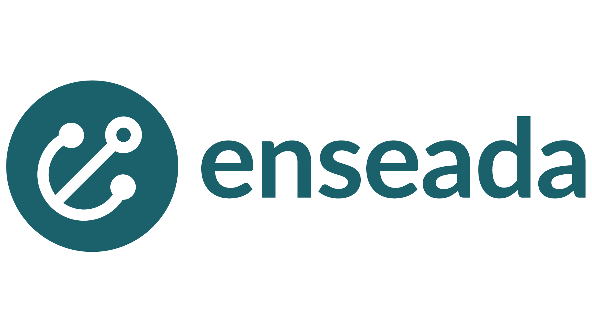

# Enseada
*A Cloud native multi-package registry*
  
[](https://github.com/enseadaio/enseada/releases/latest)

[](https://hub.docker.com/r/enseada/enseada)
[](./LICENSE)
[](https://codeclimate.com/github/enseadaio/enseada/maintainability)
[](https://codeclimate.com/github/enseadaio/enseada/test_coverage)
[](https://goreportcard.com/report/github.com/enseadaio/enseada)
[](https://discord.gg/A34Qt8A)




Enseada is a modern, fast and scalable package registry, designed from the ground up to run in elastic, container-based environments and to be highly available and distributed.

It leverages scalability by using natively distributed technologies.

Check out the [official documentation](https://docs.enseada.io) for a complete manual of operation.

## Features

- [Multiple package repositories](#supported-package-repositories)
- [Multiple storage backends](#supported-storage-providers)
- Strong authentication based on [OAuth 2.0](https://auth0.com/docs/protocols/oauth2) tokens
- Flexible ACL engine to manage user permissions 
- Complete [management API](https://docs.enseada.io/developers/apis.html)
- CDN and cache friendly

The registry itself is written in [Golang](https://golang.org/), a fast, resource efficient and statically compiled programming language
built for the Cloud.

[CouchDB](https://couchdb.apache.org/) is used as the primary datastore, containing information about
repositories, users and access control. CouchDB is a web-native database written in Erlang and based on web technologies
like HTTP and JSON.

Both local disks an object storage services are supported, altough the latter are strongly recommended for production deployments.

## Supported package repositories

Enseada is a multi-package registry, meaning it can support a large number of package
formats and registry APIs.

At the moment, the following formats are supported:

- [Maven 2/3](https://maven.apache.org/guides/introduction/introduction-to-repositories.html)
- [NPM](https://github.com/npm/registry/blob/master/docs/REGISTRY-API.md) (planned, coming soon)
- [Docker](https://docs.docker.com/registry/spec/api/) (planned, coming soon)
- [RubyGems](https://rubygems.org) (planned, coming soon)
- [Go module proxy](https://docs.gomods.io/intro/protocol/) (planned, coming soon)

## Supported storage providers

The storage layer used by Enseada provides pluggable backends, allowing to easily support
multiple storage providers.
See the [configuration guide](https://docs.enseada.io/users/configuration.html) for how to setup the storage layer.

At the moment, only these providers are supported:

- S3 compatible (AWS S3, Minio, DigitalOcean Spaces, Scaleway Object Storage, Ceph, etc)
- Google Cloud Storage
- Microsoft Azure Blobs
- Local disk

Local disk is only supported in single-node mode. To run multiple instances use an object storage provider.

## HTTPS and HTTP/2 support
Enseada has full support for strict HTTPS, enabling it is very simple.

Passing the environment value `SSL=yes|true|active` (or any kind of non-empty value) will turn on
HTTPS on the entire application (with [HSTS](https://en.wikipedia.org/wiki/HTTP_Strict_Transport_Security) enabled). This will require two
additional environment variables.

```.env
## The path to the key file
SSL_KEY_PATH=nil

## The path to the certificate file
SSL_CERT_PATH=nil
```

When HTTPS is active, Enseada switches automatically to [HTTP/2](https://en.wikipedia.org/wiki/HTTP/2). You can check
the active protocol by looking at the response body of the `GET /health` endpoint:

```json
{
    "status": "UP",
    "protocol": "HTTP/2.0",
    "host": "localhost:9623",
    "remote": "[::1]:46558",
    "method": "GET",
    "path": "/health"
}
```

## Build

Enseada is built as a statically linked executable.
If you have [Make](https://www.gnu.org/software/make/) installed, you can build a new executable
from sources by simply running `make build-server` from the root folder and then running `bin/enseada-server`.

The following tasks are available:
```bash
$ make help

all                      Build standalone server binary (default)
build-server             Build server binary
build-client             Build client binary
test-bench               Run benchmarks
test-short               Run only short tests
test-verbose             Run tests in verbose mode with coverage reporting
check test tests         Run tests
test-xml                 Run tests with xUnit output
test-coverage            Run coverage tests
lint                     Run golint
fmt                      Run gofmt on all source files
vet                      Run go vet on all source files
imports                  Run goimports on all source files
build-standalone-server  Build server binary with embedded static assets
web                      Build web assets with Webpack
rpc                      Generate RPC code
deps                     Install dependencies
clean                    Cleanup everything
update-license           Update license headers
install-hooks            Install git hooks

```

Enseada is also packaged as a [Docker image](https://www.docker.com/). Build one with `docker build -t myname/enseada:latest .`

## Web UI

Enseada comes with a management web UI. To build it from sources, NodeJS and Yarn are required.

Execute the following commands to build the static assets.

```bash
# Go the the web directory
cd web

# Install all dependencies
yarn install

# Build for development (all stylesheets, no minification)
yarn build

# Build for production (minimal stylesheets, minification)
yarn build:prod
```

To build assets for production, you can also run `make web` that will do everything for you.

Enseada will pick them up on its own. To embed them into the final executable using [go.rice](http://github.com/GeertJohan/go.rice) run `make build-standalone-server`.

## Local Database

A local CouchDB instance can be started using the provided [docker-compose.yml](./docker-compose.yml) file.
Simply run `docker-compose up -d` to start it in background, it will be available on `http://localhost:5984` and will
persist data in a Docker volume.

Upon first run, the database server is uninitialized. Please run the initialization setup for 
single node deployment by visiting http://localhost:5984/_utils/#setup and following the instructions.

## Local Minio Server

A local [Minio](https://minio.io) server can be started using the provided [docker-compose.yml](./docker-compose.yml) file.
Simply run `docker-compose up -d` to start it in background, it will be available on `http://localhost:9000` and will
persist data in a Docker volume.

Upon first run no bucket is present. Create a new one and configure the name in the appropriate environment variable 
in the Enseada configuration.

## Security Policy

If you want to report a security vulnerability, please follow the steps which we have defined for you in our [security policy](https://github.com/enseadaio/enseada/security/policy).

## Chat

Need some help or want to have a chat? Join our [Discord server](https://discord.gg/A34Qt8A)!  


## License
This Source Code Form is subject to the terms of the Mozilla Public
License, v. 2.0. If a copy of the MPL was not distributed with this
file, You can obtain one at https://mozilla.org/MPL/2.0/.
